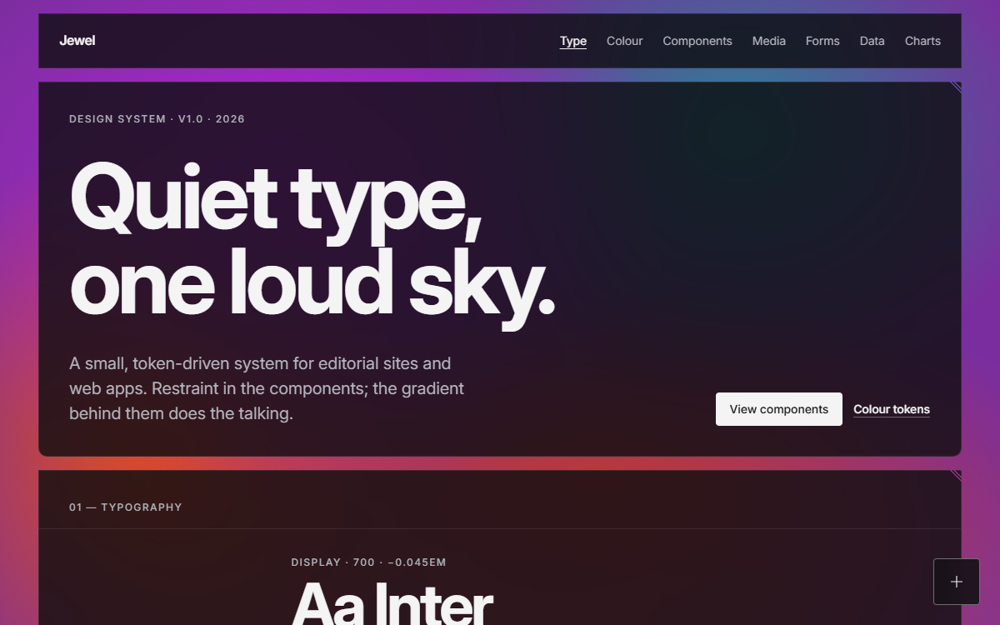

# Jewel

A dark, editorial design system for websites and web apps, made from plain HTML, CSS and a little JavaScript. There's nothing to install and no build step: you copy two folders into your project and link one file.

**[See it live →](https://willchambers.github.io/jewel-design-system/)**



## What you get

- **A look, ready to use.** Glass panels float over a slowly moving jewel-tone gradient. The type is Inter, with clear sizes and thin rules.
- **33 components and 5 patterns.** Navigation, forms, tabs, menus, dialogs, tables, charts, a chat shell and more, each one a class name you add to normal HTML.
- **Accessibility built in.** Every color pair is checked for contrast. Everything works with a keyboard and respects "reduce motion".
- **No tooling.** It's plain files. It even works when you open the page straight from a folder on your computer.
- **Easy to change.** Colors, spacing, corners and motion are all *tokens* (named settings) that you can override in one place.

## Quick start (5 minutes)

### 1. Download the files

[Download the ZIP](https://github.com/willchambers/jewel-design-system/archive/refs/heads/main.zip) and unzip it. If you use git, you can clone it instead:

```bash
git clone https://github.com/willchambers/jewel-design-system.git
```

### 2. Copy two folders into your project

From the download, copy the `css` and `js` folders into your project folder, next to where your page will go:

```
my-site/
  css/
  js/
  index.html      ← you'll create this next
```

### 3. Create your page

Create `index.html` in your project folder and paste this in. It's a complete, working page:

```html
<!doctype html>
<html lang="en" data-theme="dark">
<head>
  <meta charset="utf-8">
  <meta name="viewport" content="width=device-width, initial-scale=1">
  <title>My site</title>

  <!-- The Inter typeface -->
  <link rel="preconnect" href="https://fonts.googleapis.com">
  <link rel="preconnect" href="https://fonts.gstatic.com" crossorigin>
  <link rel="stylesheet" href="https://fonts.googleapis.com/css2?family=Inter:opsz,wght@14..32,400..700&display=swap">

  <!-- Jewel: one stylesheet, one script -->
  <link rel="stylesheet" href="css/jewel.css">
  <script src="js/jewel.js" defer></script>
</head>
<body>
  <!-- The moving gradient, and the strip that keeps content out of the gap above the header -->
  <div class="jewel-bg" aria-hidden="true"></div>
  <div class="jewel-cap" aria-hidden="true"></div>

  <div class="page">
    <header class="site-header">
      <div class="panel site-header__inner">
        <a class="wordmark link-quiet" href="/">My site</a>
        <nav class="nav" aria-label="Primary">
          <span class="nav__links"><a href="#about">About</a></span>
        </nav>
      </div>
    </header>

    <main class="panel-stack">
      <!-- Your panels go here (step 4) -->
    </main>
  </div>
</body>
</html>
```

### 4. Add your first panel

A *panel* is a glass card. Paste this inside `<main class="panel-stack">`:

```html
<section id="about" class="panel panel--pad grid">
  <header class="section-head"><p class="label">01 — About</p></header>
  <div class="span-9 start-4 stack">
    <h2>Hello, world</h2>
    <p class="lede">This page uses the Jewel design system.</p>
    <p><a class="btn" href="#">A button</a></p>
  </div>
</section>
```

### 5. Open it

Double-click `index.html` to open it in your browser. That's it: you don't need a web server. When you publish the site, upload the `css` and `js` folders along with your pages.

## Using components

A *component* is a ready-made piece of interface. You use one by adding its class names to ordinary HTML. Some also need a script, listed in the table. Load component scripts after `jewel.js`, with `defer`.

| Component | What it's for | Class to use | Script | See it |
|---|---|---|---|---|
| Button | Actions and links, plus a two-state toggle | `.btn`, `.btn--ghost`, `.btn--text`, `.btn--icon`, `.toggle` |  | [page](https://willchambers.github.io/jewel-design-system/components/button.html) |
| Floating action button | The page's one main action, fixed bottom right | `.fab`, `.fab--extended` | `sheet.js` to open a sheet | [page](https://willchambers.github.io/jewel-design-system/components/fab.html) |
| Tag | Categories, linked tags and filter buttons | `.tag`, `.tag--solid`, `.tag--button` |  | [page](https://willchambers.github.io/jewel-design-system/components/tag.html) |
| Badge | A status or count, often over a photo | `.badge`, `data-place` |  | [page](https://willchambers.github.io/jewel-design-system/components/badge.html) |
| Header | The sticky bar with links, search or a menu | `.site-header`, `.nav`, `.nav__menu`, `.nav--drawer` | `sheet.js`, `side-nav.js` (phone menu) | [page](https://willchambers.github.io/jewel-design-system/components/header.html) |
| Side nav | Grouped page links: a column on wide screens, a drawer on phones | `.side-nav`, `.with-side-nav` | `side-nav.js`, `sheet.js` | [page](https://willchambers.github.io/jewel-design-system/components/side-nav.html) |
| Breadcrumbs | Where this page sits | `.breadcrumbs` |  | [page](https://willchambers.github.io/jewel-design-system/components/breadcrumbs.html) |
| Tabs | Switch between views in place | `.tabs` | `tabs.js` | [page](https://willchambers.github.io/jewel-design-system/components/tabs.html) |
| Footer | Small print at the foot of the page | `.site-footer` |  | [page](https://willchambers.github.io/jewel-design-system/components/footer.html) |
| Accordion | Sections that open in place | `.accordion` | `accordion.js` (optional) | [page](https://willchambers.github.io/jewel-design-system/components/accordion.html) |
| Dropdown | A short menu of actions or choices | `.dropdown` | `dropdown.js` | [page](https://willchambers.github.io/jewel-design-system/components/dropdown.html) |
| Sheet | Tearsheet, modal or drawer dialog | `.sheet--bottom`, `.sheet--center`, `.sheet--start` | `sheet.js` | [page](https://willchambers.github.io/jewel-design-system/components/sheet.html) |
| Lightbox | Full-screen photo viewer | `data-component="lightbox"` | `lightbox.js` | [page](https://willchambers.github.io/jewel-design-system/components/lightbox.html) |
| Text field | Inputs, text areas and selects with labels and errors | `.field`, `.input`, `.select` | `form.js` | [page](https://willchambers.github.io/jewel-design-system/components/text-field.html) |
| Checkbox, radio, switch | Choices | `.choice` |  | [page](https://willchambers.github.io/jewel-design-system/components/choice.html) |
| Tag input | Type words to make tags | `.tag-input` | `form.js`, `tag-input.js` | [page](https://willchambers.github.io/jewel-design-system/components/tag-input.html) |
| Drop zone | Pick one photo, with a preview | `.dropzone` | `form.js`, `dropzone.js` | [page](https://willchambers.github.io/jewel-design-system/components/dropzone.html) |
| Date picker | Type a date or pick from a calendar | `.datepicker` | `form.js`, `datepicker.js` | [page](https://willchambers.github.io/jewel-design-system/components/date-picker.html) |
| Search | A search box with suggestions | `.search`, `.search--quiet` | `search.js` | [page](https://willchambers.github.io/jewel-design-system/components/search.html) |
| Filter | Tag buttons that show and hide items | `.filter`, `.filter--scroll` | `filter.js` | [page](https://willchambers.github.io/jewel-design-system/components/filter.html) |
| Notice | Info, update and error messages | `.notice`, `.notice--accent`, `.notice--error` |  | [page](https://willchambers.github.io/jewel-design-system/components/notice.html) |
| Progress | How far along a task is | `.progress` |  | [page](https://willchambers.github.io/jewel-design-system/components/progress.html) |
| Empty state | What to show when there's nothing yet | `.empty-state` |  | [page](https://willchambers.github.io/jewel-design-system/components/empty-state.html) |
| Figure | An image with a caption | `.figure`, `.figure__media` |  | [page](https://willchambers.github.io/jewel-design-system/components/figure.html) |
| Video | A looping clip with play and pause | `.figure.video` | `video.js` | [page](https://willchambers.github.io/jewel-design-system/components/video.html) |
| Index list | Numbered rows of linked items | `.index`, `.index__row` |  | [page](https://willchambers.github.io/jewel-design-system/components/index-list.html) |
| Meta list | Label and value rows | `.meta` |  | [page](https://willchambers.github.io/jewel-design-system/components/meta-list.html) |
| Quote | A pull quote | `.quote` |  | [page](https://willchambers.github.io/jewel-design-system/components/quote.html) |
| Code snippet | Code with a Copy button | `.code` | `code.js` | [page](https://willchambers.github.io/jewel-design-system/components/code.html) |
| Stat | A label with a big number | `.stats`, `.stat` |  | [page](https://willchambers.github.io/jewel-design-system/components/stat.html) |
| Data table | Sortable, selectable rows of records | `.table`, `.table-wrap` | `table.js` (optional) | [page](https://willchambers.github.io/jewel-design-system/components/table.html) |
| Chart | Line, area, bar, pie, donut, sparkline | `.chart`, `.sparkline` | `chart.js` | [page](https://willchambers.github.io/jewel-design-system/components/chart.html) |
| Chat | The shell for an AI assistant | `.chat` | `chat.js` | [page](https://willchambers.github.io/jewel-design-system/components/chat.html) |

Every component's full markup and options are in [docs/components.md](docs/components.md). Panels, the grid, section heads and the type scale are covered under [Foundations](https://willchambers.github.io/jewel-design-system/foundations/index.html).

### Patterns

Patterns show components working together. Each has a working example you can copy.

| Pattern | What it shows |
|---|---|
| [Forms](https://willchambers.github.io/jewel-design-system/patterns/forms.html) | A complete form: groups, validation, messages and a busy state |
| [Posting a photo](https://willchambers.github.io/jewel-design-system/patterns/posting-a-photo.html) | Floating button, sheet and post form, end to end |
| [Tags and photos](https://willchambers.github.io/jewel-design-system/patterns/tags-and-photos.html) | A photo wall with a tag filter, badges and a lightbox |
| [Data](https://willchambers.github.io/jewel-design-system/patterns/data.html) | A report page: a hero number, stats, a chart and a table |
| [Media](https://willchambers.github.io/jewel-design-system/patterns/media.html) | An editorial layout of figures, video, facts and a quote |

### Example: a row of stats

```html
<dl class="stats">
  <div class="stat">
    <dt class="stat__label">Stations</dt>
    <dd class="stat__value">148</dd>
  </div>
  <div class="stat">
    <dt class="stat__label">Members</dt>
    <dd class="stat__value">12.4<span class="stat__unit">K</span></dd>
    <dd class="stat__note">Up a third since January</dd>
  </div>
</dl>
```

Each stat is a label (`dt`) and a value (`dd`). Write the value exactly as you want it read.

### Example: a chart from a table


You write a normal table. The first column becomes the x axis and each other column becomes a line:

```html
<figure class="chart" data-component="chart" data-type="line">
  <figcaption>
    <span class="chart__title">Monthly rides</span>
    <span class="chart__subtitle">By bike type, 2026</span>
  </figcaption>
  <table>
    <thead><tr><th>Month</th><th>Classic</th><th>Electric</th></tr></thead>
    <tbody>
      <tr><th>Jan</th><td>120,400</td><td>61,200</td></tr>
      <tr><th>Feb</th><td>118,200</td><td>63,900</td></tr>
      <tr><th>Mar</th><td>141,900</td><td>78,400</td></tr>
    </tbody>
  </table>
</figure>
<script src="js/components/chart.js" defer></script>
```

Change `data-type` to `area`, `bar`, `pie` or `donut` for other charts. The table stays on the page behind a "Show data" link, so the numbers are always readable. More in [docs/charts.md](docs/charts.md).

### Example: a form field

```html
<form class="form" data-component="form" novalidate>
  <div class="field">
    <label class="field__label" for="email">Email</label>
    <input class="input" id="email" name="email" type="email" required>
  </div>
  <div class="form__actions">
    <button class="btn" type="submit">Send</button>
  </div>
</form>
<script src="js/components/form.js" defer></script>
```

`form.js` checks the fields when someone leaves them or submits, and shows a message under any that need fixing.

### Example: a notice

```html
<div class="notice notice--error" role="alert">
  <p class="notice__text">Couldn't load your photos. Check your connection.</p>
  <div class="notice__actions"><button class="btn btn--ghost" type="button">Retry</button></div>
</div>
```

Leave out `notice--error` for general information, or use `notice--accent` for good news.

## Using Jewel in a web app

Jewel is plain HTML and CSS, so it works with any framework (React, Vue, Svelte) or none. Link `css/jewel.css` once, then use the class names in your templates.

Components with behaviour (tabs, dropdowns, forms, charts…) are wired up when the page loads. If your app adds markup later, call `Jewel.mount()` on the new part:

```js
container.innerHTML = renderPhotos(photos);   // your code
Jewel.mount(container);                       // wires up any data-component inside it
```

Components tell your code what happened with events, so you never edit Jewel's scripts:

```js
document.querySelector('#post-form').addEventListener('jewel:post', (e) => {
  e.detail.waitUntil(upload(e.detail.formData));   // the form stays busy until this settles
});
```

Each component's page lists its events, and [docs/components.md](docs/components.md) has the full list.

## Customising

Jewel's settings are *tokens*: named values like `--bg-speed` or `--panel-radius-bottom`. Every component reads its colors, sizes and timings from them, so changing a token changes everything that uses it.

To change one, don't edit Jewel's files. Add your own stylesheet *after* `jewel.css` and set the token there:

```html
<link rel="stylesheet" href="css/jewel.css">
<link rel="stylesheet" href="my-styles.css">
```

```css
/* my-styles.css */
:root {
  --bg-speed: 60s;                /* slow the background down (default 32s) */
  --panel-radius-bottom: 4px;     /* subtler rounded bottom corners (default 10px) */
  --knockout-offset: 12px;        /* move the corner lines further in (default 6px) */
}
```

Your stylesheet always wins over Jewel's, because Jewel puts its own styles in *cascade layers* (named groups of CSS that rank below anything outside them). You never need `!important`.

**Be careful with colors.** Every text and edge color has been checked for contrast against the glass, over every part of the gradient. If you change one, recheck it the way [docs/accessibility.md](docs/accessibility.md) describes. The full list of tokens is in [docs/tokens.md](docs/tokens.md).

## Adding your own component

1. Copy `css/components/_template.css` to `css/components/your-name.css`. It explains the rules inside.
2. Add one line to `css/jewel.css`:
   ```css
   @import url("components/your-name.css") layer(components);
   ```
3. If it needs behaviour, copy `js/components/_template.js` the same way and load it after `jewel.js`.
4. Show it on the specimen: copy a page in `components/`, and add one line to the `NAV` list in `specimen/specimen.js`.

Use tokens, not raw colors or pixel values, so your component fits in automatically. The full rules are in [docs/components.md](docs/components.md#adding-a-component).

## Accessibility

**Built in:**

- Every text color meets WCAG AA contrast on glass and solid panels.
- Everything can be used with a keyboard, with a visible focus ring.
- Motion stops when someone turns on "reduce motion" in their system settings.
- Touch targets are at least 44px on phones.
- Charts can be read with arrow keys, and each one keeps its data table.

**Still up to you:**

- Write `alt` text for every image that carries meaning.
- Give every form field a `<label>`.
- Keep headings in order (`h1`, then `h2`…) and write link text that makes sense on its own.
- Give each sparkline an `aria-label` that says the trend, e.g. "Up from 9,100 to 12,400".

Details and the contrast measurements are in [docs/accessibility.md](docs/accessibility.md).

## Troubleshooting

**I changed a CSS file but the page looks the same.** Your browser is showing an old copy. Do a hard refresh: Ctrl+Shift+R on Windows, Cmd+Shift+R on a Mac.

**Something with `hidden` still shows.** Your own CSS probably gives it a `display` value, which wins over `hidden`. Remove that `display`, or write the rule as `.thing:not([hidden])`.

**Items inside a `.stack` have no space between them.** Something is setting `margin: 0` on them, which cancels the stack's spacing. Let `.stack` space its children and don't set their margins.

**A chart doesn't appear.** Check that `chart.js` loads after `jewel.js`, and that the table has both a `<thead>` and a `<tbody>`.

**The page shows as plain, unstyled text.** Check that the `css` and `js` folders sit next to your page and that the paths in `<head>` match. On Windows, if you opened the page from a deeply nested folder, the full path to Jewel's files may be longer than Windows allows (260 characters), so none of them load. Move your project to a shorter folder, such as `C:\sites\my-site`.

**Form messages don't appear.** Check that the form has `data-component="form"` and `novalidate`, and that `form.js` loads before `tag-input.js`, `dropzone.js` and `post-form.js`.

**Content scrolls into the gap above the header.** The `<div class="jewel-cap">` is missing. It goes right after `<div class="jewel-bg">`.

**The background is slow on an old phone.** Add `data-bg="paused"` to `<html>` to stop the animation.

## Learn more

- [docs/components.md](docs/components.md): every component's markup, options, events and scripting
- [docs/charts.md](docs/charts.md): chart types, options, behaviour and the color palette
- [docs/tokens.md](docs/tokens.md): every token, what it does, and performance notes
- [docs/accessibility.md](docs/accessibility.md): what's built in, keyboard behaviour and all contrast measurements
- [The live specimen](https://willchambers.github.io/jewel-design-system/): a page for every foundation, component and pattern, with live examples and copy-paste code. Open `index.html` from the download to browse it offline.

## What's in the folder

```
css/            the system: link css/jewel.css
js/             jewel.js and one script per component that needs one
docs/           the full reference
index.html      the specimen site's home page
foundations/    specimen pages: type, color, spacing, layout, surfaces, motion
components/     specimen pages: one per component
patterns/       specimen pages: components working together
specimen/       styles and scripts for the specimen site only (not part of the system)
media/          artwork used on the specimen
```
