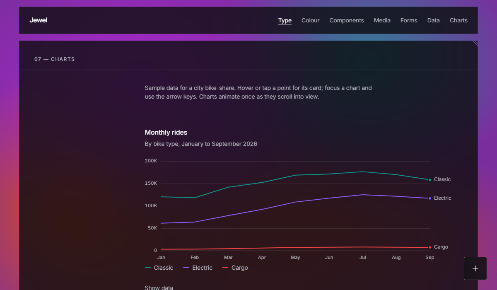

# Charts

Line, area, bar, pie, donut and sparkline charts. They're hand-built SVG with no charting library. You can see them all in the [live specimen](https://willchambers.github.io/jewel-design-system/components/chart.html).



## How it works

Each chart is drawn from a plain HTML table. The table stays on the page as the chart's data view, behind a "Show data" link, so every number is readable without the chart. If scripts don't run, the table is all that shows.

```html
<figure class="chart" data-component="chart" data-type="line">
  <figcaption>
    <span class="chart__title">Monthly rides</span>
    <span class="chart__subtitle">By bike type, 2026</span>
  </figcaption>
  <table>
    <thead><tr><th>Month</th><th>Classic</th><th>Electric</th></tr></thead>
    <tbody><tr><th>Jan</th><td>120,400</td><td>61,200</td></tr> …</tbody>
  </table>
</figure>
<script src="js/components/chart.js" defer></script>
```

- The first column is the categories: the x axis, or the pie slices.
- Each further column is a series.
- Write cells as they should read ("42%", "$4.2M", "120,400"). The hover card shows your text exactly; the chart reads the number inside it.
- An empty cell leaves a gap in a line.
- The table needs both a `<thead>` and a `<tbody>`.

## Options

| Option | Values |
|---|---|
| `data-type` | `line`, `area`, `bar`, `pie`, `donut`, `sparkline` |
| `data-stacked` | Stack area or bar series |
| `data-prefix`, `data-suffix` | For axis ticks: `$`, `%`, `h` |
| `data-height` | Plot height in px (default 260) |
| `data-center-label`, `data-center-value` | The donut's center (default: "Total" and the sum) |

Axis ticks use one number style per axis: compact (`50K`) when any tick reaches 10,000, plain otherwise. Whole-number data gets whole-number ticks.

## Sparkline

A tiny trend line for inside a [stat](components.md#stat). It's the one chart that takes its data from attributes:

```html
<dd>
  <span class="sparkline" data-component="chart" data-type="sparkline"
        data-values="9100,9400,9900,10400" data-labels="Jan,Feb,Mar,Apr"
        data-name="Members" aria-label="Members, January to April: up from 9,100 to 10,400"></span>
</dd>
```

- `data-values`: the numbers, comma-separated.
- `data-labels`: one label per value, shown in the hover card.
- `data-name`: the label beside the value in the card.
- `aria-label`: say the trend in words; a screen reader hears this instead of the line.

Sparklines draw in the context gray, with the latest point in the accent. Their hover card always opens upward, so it stays inside its panel.

## Behavior

- **Load animation**, once, when a third of the chart is on screen: lines draw in, bars grow from the baseline, and pie/donut slices sweep round. With reduced motion, charts appear finished.
- **Hover card** near the cursor, listing every series at that point: the value first, then a short line key and the series name, plus a total on stacked charts. Line and area charts snap to the nearest x with a crosshair and light the dots; a bar chart's whole column band is the target; pie slices lift. Tap on touch screens.
- **Keyboard:** each chart can be tabbed to. The arrow keys step through points or slices, Home/End jump, Esc hides. A live region reads "Feb: Classic 118,200, Electric 63,900".
- **Legend** for two or more series; one series is named by its title. Line charts also label each line's end when the labels don't collide.
- Redraws on resize. Labels are inserted as text only.
- On phones, a wide data table scrolls sideways inside its panel instead of widening the page.

## Marks

Marks follow established data-visualization specs:

- 2px lines; bars at most 24px wide with a 4px rounded end and a square base; area washes at 12%.
- Solid hairline gridlines.
- 2px gaps between touching bars, segments and slices, cut out, never outlined.
- Text in text colors, never series colors.
- Pie charts fold past 6 slices into "Other".
- Past 5 series, colors never cycle: the extra series turn gray and the console warns. Fold extras into "Other" or split the chart.

## Colors

One palette: Jewel's hues, stepped for the dark surface, in a fixed order.

| Slot | Token | Color |
|---|---|---|
| 1 | `--chart-1` | Teal `#0D9488` |
| 2 | `--chart-2` | Purple `#8B5CF6` |
| 3 | `--chart-3` | Red `#EF4444` |
| 4 | `--chart-4` | Magenta `#D946EF` |
| 5 | `--chart-5` | Orange `#EA580C` |
| 6+ | `--chart-context` | Gray `#7A7A84` |

A series keeps its color by its column position, never by rank, so filtering never repaints the survivors.

**How the palette was chosen.** A palette validator searched every combination of shades (the Tailwind 400, 500 and 600 steps of each hue) and every order of the five hues. It kept the 384 combinations that pass every check, and chose the one with the best separation between neighboring colors:

- **Color-blind separation:** worst adjacent pair ΔE 18.9 under simulated protanopia and deuteranopia (target 8, floor 6). ΔE is the distance between two colors in OKLab, ×100.
- **Normal-vision separation:** worst adjacent pair ΔE 25.0 (floor 15).
- **Contrast against the surface:** at least 4.45:1 on solid panels and 3.07:1 on the lightest glass (marks need 3:1).
- **Lightness and colorfulness:** every slot sits in the dark-mode lightness band and above the chroma floor, so no color reads as gray.

The context gray is ΔE 24.4 from the accent and 3.06:1 on the lightest glass.
